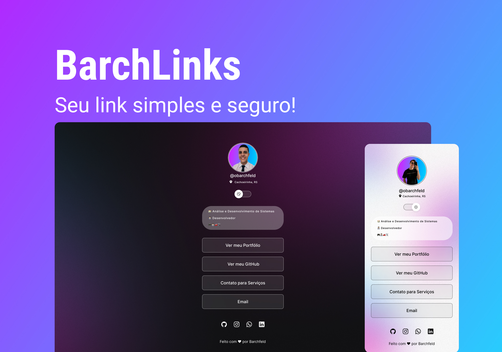

<h1 align="center"> BarchLinks </h1>

 

  

## 🚀 Tecnologias

Esse projeto foi desenvolvido com as seguintes tecnologias:

- HTML e CSS
- JavaScript
- Git e Github
- Figma

## 💻 Projeto

O BarchLinks é um agregador de links para usar como cartão de visitas online.

- [Acesse o projeto finalizado, online](https://barchlinks.matheusbarchfeld.com.br)

---

Feito com ♥ by Barchfeld :wave: [Entre no site](https://www.matheusbarchfeld.com.br)
